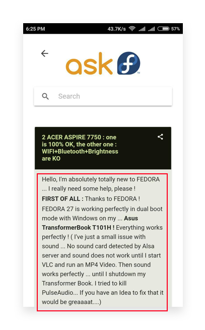
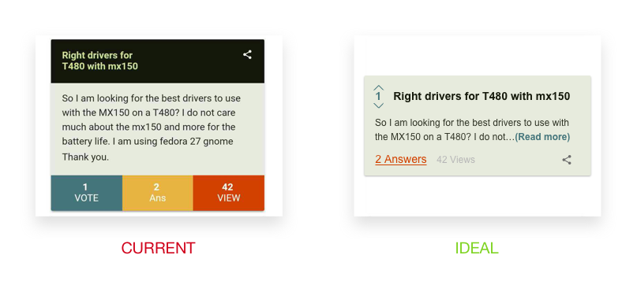

# Ask Fedora

## Showing all the information upfront
The body of the question shows all the information upfront which means the user has to scroll through all the information(which is often long) even if he’s not interested in the question. Using a simple "read more" can fix this issue.

## Vote, answers and views look like buttons
Users should not waste time in wondering if they can click something, only to discover that they can’t.

#### Solution
Use better hierarchy and make it evident what’s a link, what is not.
