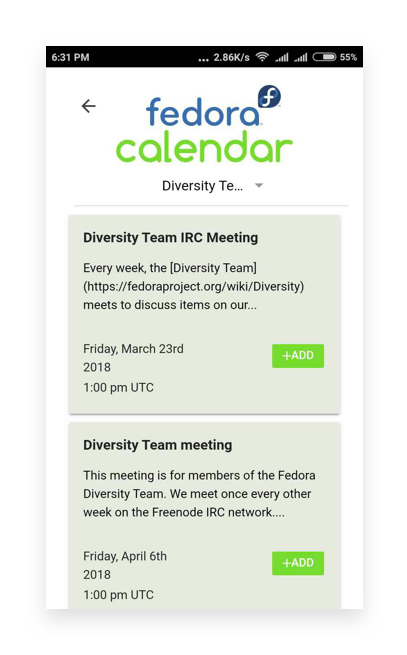
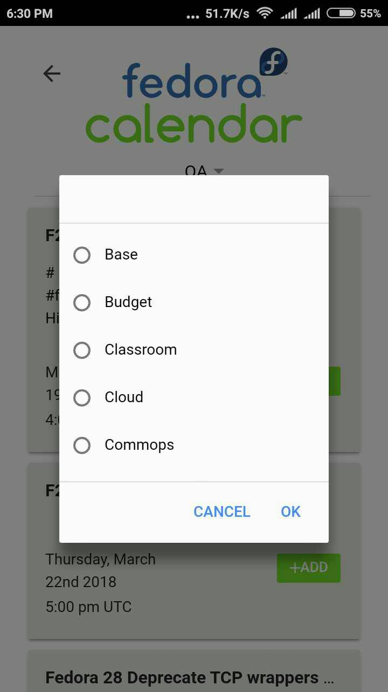
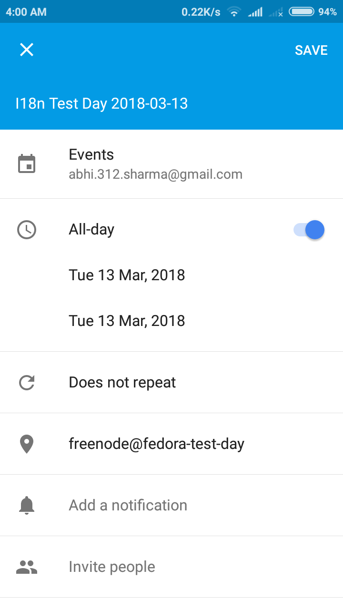

# Calendar

## No option to read the full description
The description of a specific event has been trimmed down and ends with an ellipsis but there is no option to read the complete description.

## Unlabelled Dropdown
The Dropdown menu has a missing label which makes it difficult to identify what can we do the drop-down menu. Only the Fedora developers who are familiar with the team lingo can figure out that the dropdown can be used to view particular team’s calendar.

## Missing Time in Google Calendar

It is a kind of bug. While adding an event to the Google Calendar, the time is not added automatically even though it shows up in the Fedora App.

