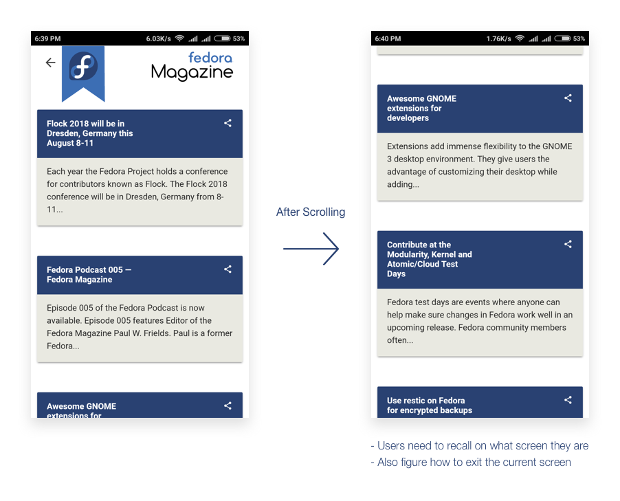
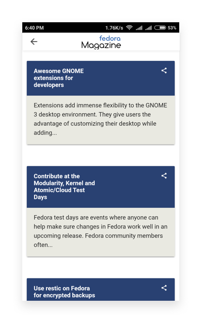
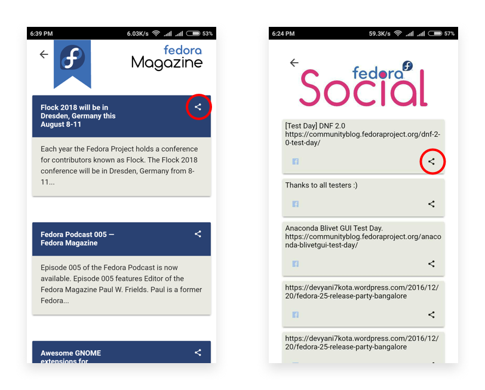
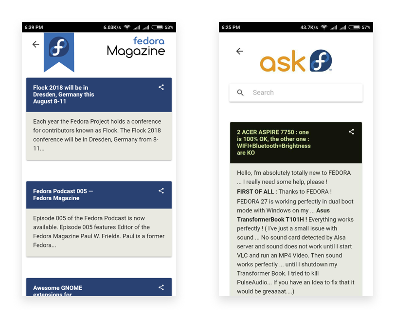

# Common Issues
## Missing Navigation
One common issue on all the feature screens is a missing navigation bar.

Once the users have scrolled through the content, they can’t know the current state of the system which violates Norman’s heuristic of [Visibility of system status](https://www.nngroup.com/articles/ten-usability-heuristics/) 
> The system should always keep users informed about what is going on, through appropriate feedback within reasonable time.

Also since there is no visible navigation, in case users want to go back to the previous screen — They will have to recall from their memory to use the back button of the mobile, which violates Norman’s heuristic of [Recognition rather than recall](https://www.nngroup.com/articles/ten-usability-heuristics/). 
> Minimize the user's memory load by making objects, actions, and options visible. The user should not have to remember information from one part of the dialogue to another. Instructions for use of the system should be visible or easily retrievable whenever appropriate.

#### Solution
Use a sticky header that stays fixed when the users scroll through the content.

## Size of Share Icon
The share icon has really small size which makes it difficult to click on.
Small touch targets make users work harder because they require more accuracy to hit. Users need to reorient their finger, from finger pad to fingertip, to hit the target with clear visual feedback.

> Apple’s iPhone Human Interface Guidelines recommends a minimum target size of 44 pixels wide 44 pixels tall. Microsoft’s Windows Phone UI Design and Interaction Guide suggests a touch target size of 34px with a minimum touch target size of 26px.

## Inconsistent Headers
The headers of the individual pages are inconsistent. 

This violates the Norman’s Heuristic of [Consistency and standards](https://www.nngroup.com/articles/ten-usability-heuristics/). There should be a fixed consistent style of headers used all throughout the application. We should be using design as a system to our aid.
