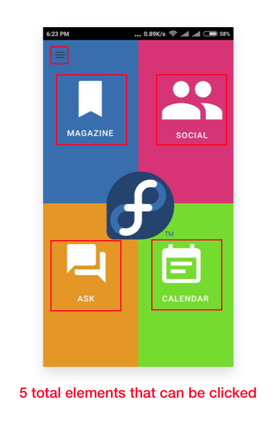
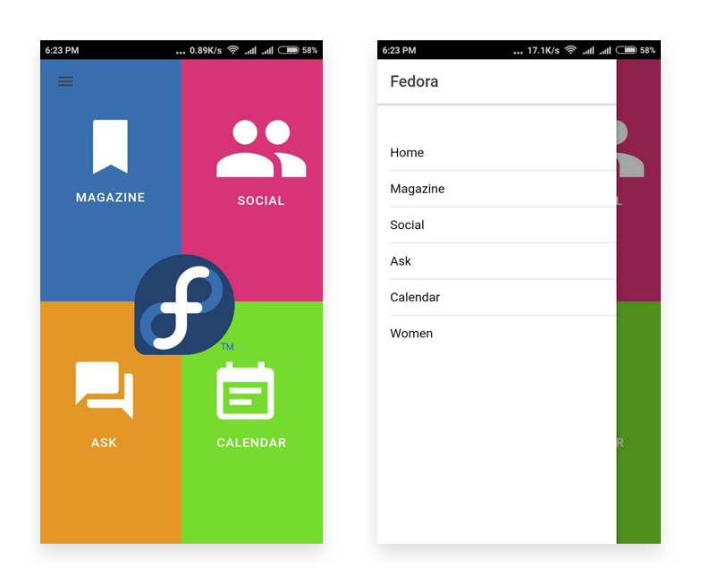
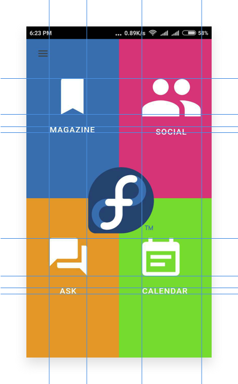

# Home Screen
## Position of Fedora logo
The first thing that greets the user after the opening is the Fedora logo at the centre.  At the first glance, it is not sure if the logo is clickable and does something (It doesn’t). The fact that it is surrounded by 4 clickable elements doesn’t help the case. 
>Every extra unit of information in a design competes with the relevant units of information and diminishes their relative visibility

According to [Hick’s law](https://en.wikipedia.org/wiki/Hick%27s_law), the time it takes to make a decision increases with the number and complexity of choices. In order to craft a better experience for the users, the application should avoid having too many options with an equally perceived hierarchy which ultimately can cause paralysis of analysis.

#### Solution
An obvious solution would be to remove the logo (Keep it simple, stupid). But in case the logo has to stay on the home screen, we can add a navigation bar at the top with the app name and logo. 

However, a **better long-term solution** would be to use a **bottom navigation** instead of the current design. Using the bottom navigation will allow the user to make quicker decisions and all the options can be comfortably reached with one-thumb interactions. All the current 4 features can be grouped into separate tabs, but the problem will arise when we need to add more features.

In order to solve that, we can group similar categories together or introduce a 4+1 tab design (4 core features + One **More** tab).

## Redundant Navigation

The options presented in the hamburger menu on the left are same as the ones on the home screen. Also, the hamburger is not accessible from another screen of the application. This makes the options kind of redundant. Hence, the navigation bar can be altogether removed but doing this will be a bad design pattern since we won’t be able to scale the application with more features with the current design.

#### Solution
Use a bottom navigation bar. :-)

## Unaligned Icons
It’s a small detail but worth mentioning. The icons on the home screens are not aligned with each other and symmetry is missing in the layout.

