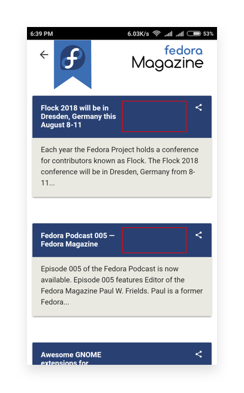
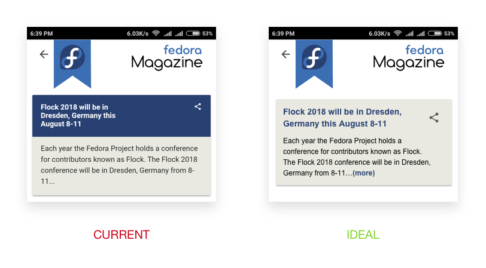

# Fedora Magazine
## Flawed width of Title
This is more of a UI bug. The width of the title of a blog post is fixed to a wrong value which creates a ugly spacing after the name.

## Not Sure What’s clickable
The current hierarchy doesn’t make it obvious what is clickable and what is not. An average user would think that tapping on the text with ellipsis (the body content of post) would lead him to the actual post, but it is in fact not clickable. You need to click the title of the post to navigate to the main post page.

#### Solution

Without adding any additional functionality, we can use proper hierarchy between the title and body, and additionally using a "more" link element to let the user know where to click.