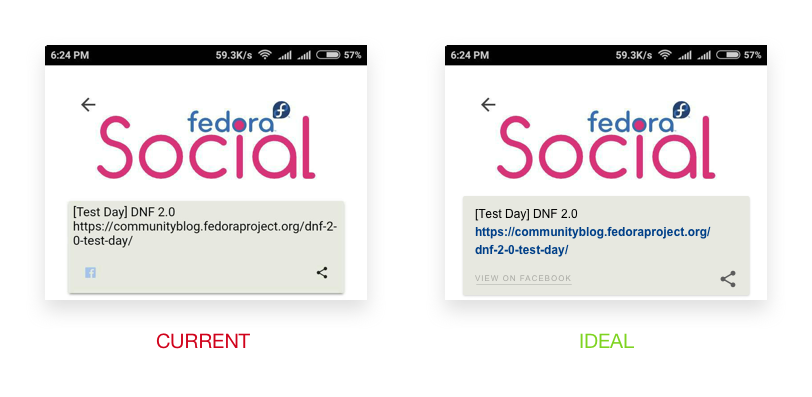

# Social
## Filter between Facebook and Twitter
Not really an issue but a nice to have. Since same posts are shared on Facebook and Twitter account of Fedora, it would have been better if there was some kind of filter to see only Facebook post or only twitter post.

## Disabled links in the post
The hyperlinks in the social media posts are unclickable. Sometimes it may happen that someone just want to visit a URL mentioned in the post rather than visiting the original post.

## Unresponsive Social Media Logo
The Logo of respective social media site in the post component does not serve any purpose except the fact it tells that the post has been fetched from that social network. On the first glance, I thought that clicking that logo will lead me to the original post on the social network but it does not have a tap event. Also the contrast between the logo and background is not optimal, which makes it hard to look at.

